# M1.870 - Fundamentos de ciberseguridad.
# José Enrique Rodríguez González.
# PEC3: Ataques y medidas de ciberdefensa.

---

## Indice.
- [Enunciado.](#enunciado)
- [Introducción a Kathará.](#introducción-a-kathará)
- [Actividad.](#actividad)
- [Respuesta a la preparación de la actividad.](#respuesta-a-la-preparación-de-la-actividad)
- [Respuesta al apartado 1](#respuesta-al-apartado-1)
- [Respuesta al apartado 2.](#respuesta-al-apartado-2)
- [Respuesta al apartado 3.](#respuesta-al-apartado-3)
- [Respuesta al apartado 4.](#respuesta-al-apartado-4)
- [Respuesta al apartado 5.](#respuesta-al-apartado-5)
- [Respuesta al apartado 6.](#respuesta-al-apartado-6)
- [Respuesta al apartado 7.](#respuesta-al-apartado-7)
- [Respuesta al apartado 8.](#respuesta-al-apartado-8)
- [Respuesta al apartado 9.](#respuesta-al-apartado-9)
- [Respuesta al apartado 10.](#respuesta-al-apartado-10)

---

## Enunciado.

Para proteger adecuadamente una red es necesario disponer de conocimientos avanzados en redes y sistemas operativos.

Usaremos en esta PEC 3 una topología de red ya implementada usando Kathará1 en una
OVA con Kali Linux que tendréis disponible en el aula.

Kathará es un sistema ligero de emulación de red basado en contenedores Docker que es realmente útil para realizar demostraciones interactivas, probar redes de producción en un espacio aislado o el desarrollo de nuevos protocolos de red.

En esta PEC3, planeamos usar Kathará como nuestro entorno virtual para simular una
arquitectura de red con diferentes dispositivos.

[Volver al índice.](#indice)

---

<br><br>

## Introducción a Kathará.

Para arrancar el laboratorio será preciso situarse en la carpeta del laboratorio, concretamente en labs/PEC3 de la HOME del usuario kali. Los comandos que precisamos para usar Kathará son los siguientes:


```sudo kathara lstart``` (para iniciar el escenario)  
```sudo kathara lclean``` (para pararlo)  
```sudo kathara lstop``` ((para limpiar todas las instancias de Docker abiertas).)

[Volver al índice.](#indice)

---
<br><br><br><br><br><br><br><br><br><br><br><br><br><br><br><br><br><br><br><br><br><br><br><br><br><br><br><br><br><br><br><br><br><br><br>

## Actividad

Tenemos configurada la red siguiente:

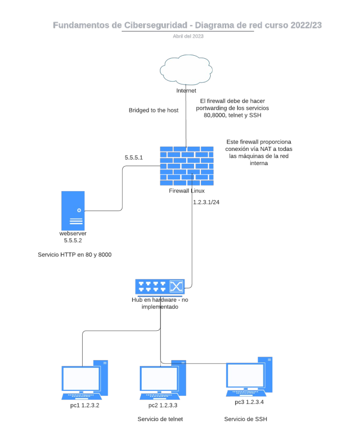


Demuestra con capturas de pantalla de tu entorno las operaciones siguientes y responde a todas las preguntas.
Nota: aseguraros que aparezca en la shell vuestro nombre de usuario de la UOC en
todas las capturas de pantalla. Podéis utilizar el comando:

```export PS1=(usuarioUOC)$PS1```

Ejemplo:

```export PS1=(gfarrasb)$PS1```

Adicionalmente proporciona una explicación para justificar qué realiza cada captura:

1. Demuestra con tcpdump que pc1 recibe un paquete ICMP desde pc2. Filtra con tcpdump solamente los echo requests. ¿Qué aparece en el campo flags ? ¿Qué significa exactamente este campo ? **(5% puntos)**.

2. Realiza desde pc3 pings a distintas máquinas. Muestra la tabla ARP en pc3. ¿Para qué sirve este protocolo? Ahora, suprime la entrada correspondiente a pc2 y añade manualmente una nueva dirección MAC indicando que la dirección mac de pc2 es aa:bb:cc:dd:ee:ff. ¿Qué pasa? **(10% puntos)**.

3. En pc2 tienes un usuario nuevo "user2". Analiza la línea que contiene la contraseña cifrada del usuario "user2" del fichero `/etc/shadow` indicando qué significa cada campo. Explica cómo podrías conseguir de nuevo dicha esta contraseña cifrada usando el comando `openssl passwd` y el parámetro salt. **(10% puntos)**.

4. ¿Qué tipo de clave utiliza el servidor de SSH ? Muestra la clave del servidor a través de una captura de pantalla. **(10% puntos)**.

5. Explica, con tus propias palabras, en qué consiste un ataque de Directory Transversal Attack y qué tiene qué ver en este caso. Realiza una demostración de este ataque a partir del entorno proporcionado. **(10% puntos)**.

6. Existen multitud de técnicas para realizar escaneos de red. Utiliza dos tipos de técnicas distintas de port scanning con nmap para analizar el firewall desde tu máquina. Comenta qué diferencias hay entre cada una y comenta los resultados obtenidos. **(10% puntos)**.

7. Demostrad ahora que podéis arrancar el laboratorio en modo "privileged" y os podéis conectar a alguna de las máquinas. **(10% puntos)**.

8. Nos interesaría que el servidor de telnet actuara de honeypot así que, todas las direcciones IP que conecten más de una vez por día en este honeypot, filtrarlas de algún modo. ¿Cómo podríamos hacerlo? Solamente explicadlo, no debe de implementarse. **(5% puntos)**.

9. Conectaros vía telnet desde vuestra máquina host a pc2 y demostrad cómo podéis capturar el usuario y contraseña, que viajan en claro. **(10% puntos)**.

10. Analizad con wireshark el fichero random.pcapng (tenéis más información sobre donde localizar los ficheros para esta actividad más abajo). Debéis de encontrar una contraseña que os puede ser útil para más adelante. Este ejercicio debéis de hacerlo fuera del entorno de Kathará. **(10% puntos)**.

11. Este último punto está para la valoración subjetiva del profesorado con los conceptos siguientes: capturas de pantalla cumpliendo requisitos, redacción clara y adecuada, ortografía correcta, entrega en formato PDF en el RAC de la asignatura, etc.. **(10% puntos)**.

[Volver al índice.](#indice)

---

<br><br><br><br><br><br><br><br><br><br><br><br><br><br><br><br><br><br><br><br><br><br><br><br><br><br><br><br><br><br><br><br><br><br><br><br><br><br><br><br><br><br><br><br>

## Respuesta a la preparación de la actividad.

Previamente, para mayor facilidad, procederemos a cambiar el teclado a teclado Español.

Procedo a realizar los procedimientos indicados para la preparación de la actividad.

Para ello ejecuto el comando en consola de:

~~~

export PS1="(jrodriguezgonzalez6)$PS1"

~~~

Quedando la consola de la siguiente manera:

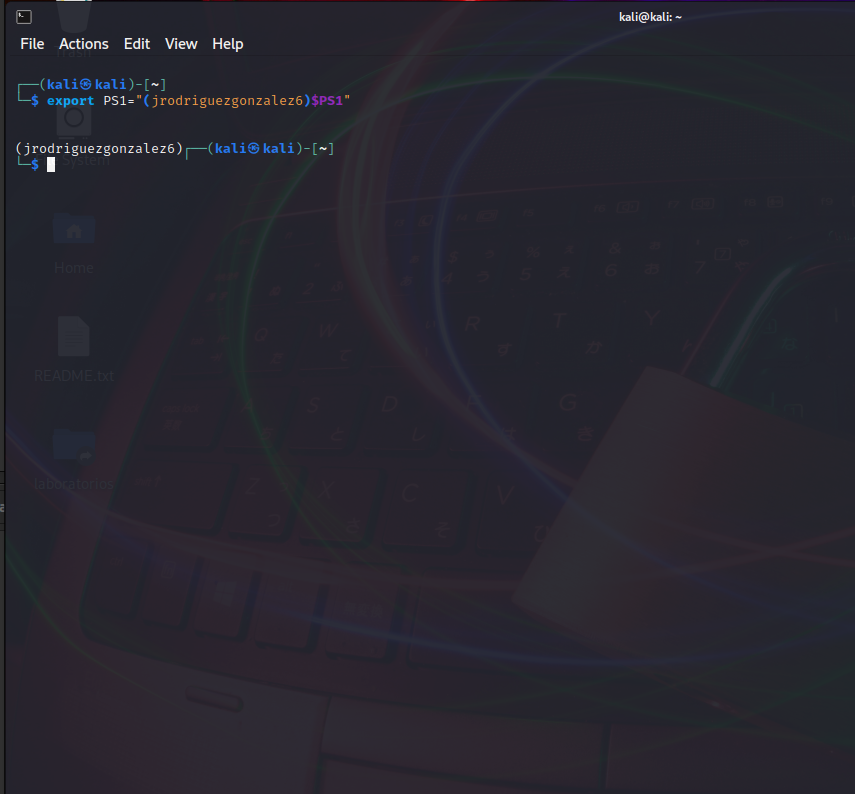

Procedemos a iniciar *Kathara*.

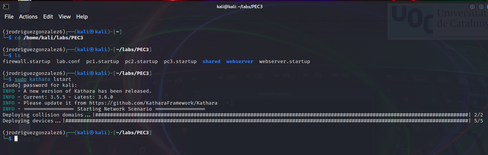

dejamos las consolas de cada una de las VM con nuestro usuario de la UOC:

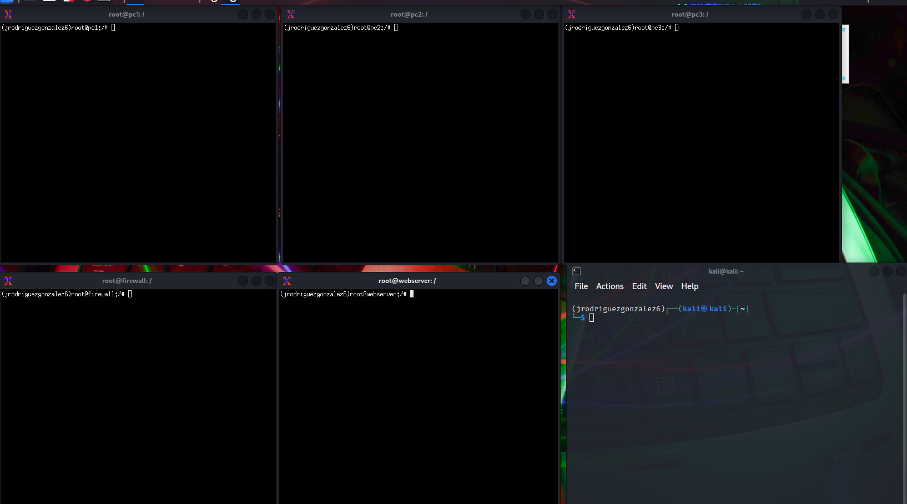

[Volver al índice.](#indice)

---

<br><br><br><br><br><br><br><br><br><br><br><br>

## Respuesta al apartado 1.

Procedemos en PC a ver cual es la dirección IP, que según el dibujo de arriba es `1.2.3.2`, para ello usaremos el comando `ifconfig`.

Procedemos a ejecutar el comando ```sudo tcpdump -i eth0 icmp[icmptype] == 8``` desde el firewall, por un lado y por otro procederemos a realizar ping desde pc2 a pc1. El podemos ver que el firewall captura los ICMP.

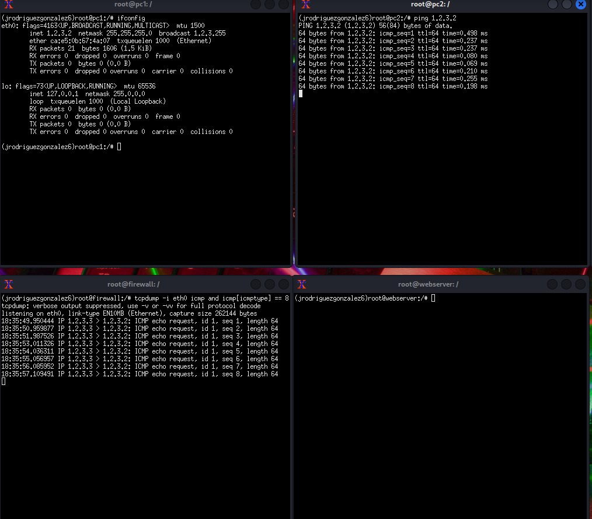

El comando ```sudo tcpdump -i eth0 icmp[icmptype] == 8``` Captura solo los paquetes ICMP de la interfaz eth 0. Al ejecutarlo, muestra una lista de los paquetes ICMP echo request que se reciben en pc1 desde pc2. Como se puede ver en la imagen, muestra información sobre cada paquete capturado, ademas, se muestra el tipo de paquete, en este caso, paquetes ICMP.

[Volver al índice.](#indice)

---

<br><br><br>

## Respuesta al apartado 2.

Para responder a este apartado, desde PC3 hemos hecho un ping a PC1 (1.2.3.2) y a PC2 (1.2.3.3), a continuación, hemos buscado la tabla arp de PC3. Como se muestra la siguiente imagen.

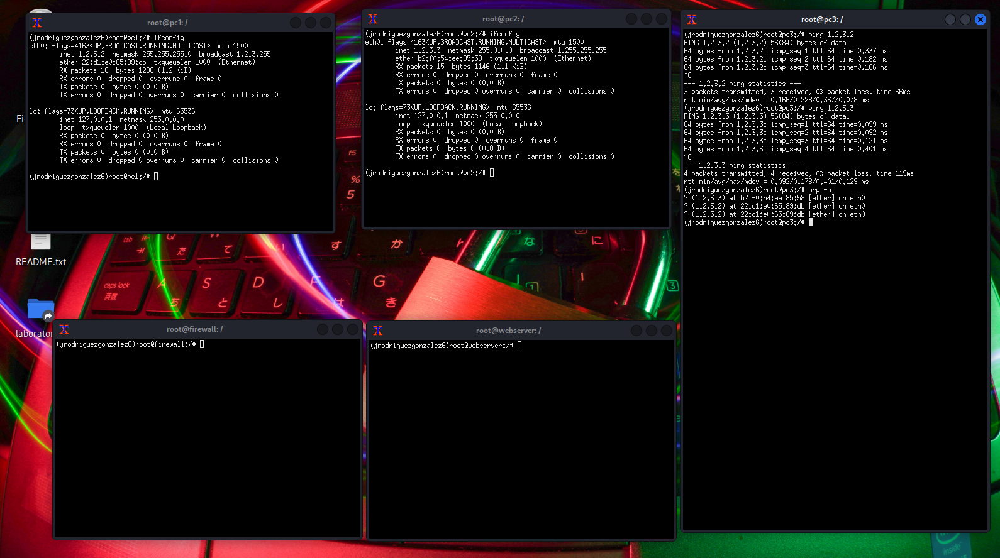

con el comando `arp -d 1.2.3.3` eliminamos de la tabla ARP la mac asociada a 1.2.3.3 y con el comando `arp -s 1.2.3.3 aa:bb:cc:dd:ee:ff` le asignamos una MAC distinta en la tabla ARP. La tabla ARP no es mas que una tabla que asocia MAC a direcciones IP del mismo dominio de colisión o dominio de Broadcast. En este caso, al asignarle una nueva MAC de destino, los paquetes ip se pierden, como se puede ver en las estadísticas de la siguiente imagen. Para solventar este problema, se recomienda eliminar la MAC asociada a la ip 1.2.3.3 tal y como se muestra en la siguiente imagen.

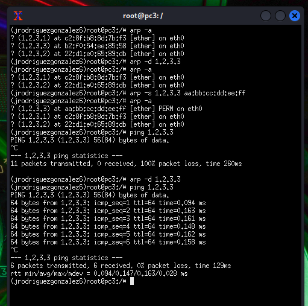

[Volver al índice.](#indice)

---

<br><br><br><br><br><br><br><br><br><br><br><br><br><br><br><br><br><br><br>

## Respuesta al apartado 3.

En PC2, procedo a hacer un `cat /etc/shadow`, procedo a buscar user2 y obtengo los siguientes datos

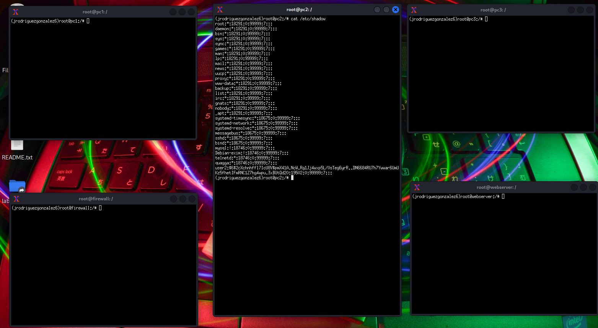

~~~

user2:$6$2cXchnhffl7IcU8V$pmX41A.NcW.Rg1Jj4wxp5L/0sTeg6yrR..DN6684RU7h7Ywwar6UmUKz5fhetIFmRNC1Z7hg4wpu.3xBUtQd20:19502:0:99999:7:::

~~~

Donde:

- `user2`: Es el nombre de usuario.
- `$6`: Indica el tipo de algoritmo de cifrado utilizado para la contraseña. En este caso, "$6" representa el uso del algoritmo de cifrado SHA-512.
- `$2cXchnhffl7IcU8V`: Es un valor aleatorio utilizado como "sal" para fortalecer el cifrado de la contraseña.
- `pmX41A.NcW.Rg1Jj4wxp5L/0sTeg6yrR..DN6684RU7h7Ywwar6UmUKz5fhetIFmRNC1Z7hg4wpu.3xBUtQd20`: s la contraseña cifrada propiamente dicha
- `19502`: Indica la fecha de expiración de la cuenta de usuario, expresada en días desde la fecha de referencia (epoch). Si está vacío, la cuenta no tiene fecha de expiración
- `0`: Especifica el número mínimo de días que deben transcurrir antes de que el usuario pueda cambiar su contraseña.
- `99999`: Indica el número máximo de días después de los cuales el usuario debe cambiar su contraseña.
- `7`: Es el número de días antes de que expire la contraseña en los que se mostrará un mensaje de advertencia.

Para obtener de nuevo la contraseña, procedemos a ejecutar en pc2 el siguiente comando:

<br>

~~~

openssl passwd -6 -salt 2cXchnhffl7IcU8V hola

~~~

Como hemos usado la **salt** especifica del usuario en cuestión, hemos procedido a cambiar la nueva contraseña de este usuario, de esta manera, hemos cambiado la pass del user2 a `hola`.

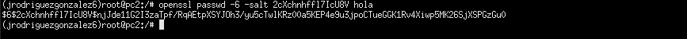

Como vemos, la consola nos responde con la pass cifrada `$6$2cXchnhffl7IcU8V$njJde11G2I3zaTpf/RqAEtpXSYJOh3/yu5cTwlKRz00a5KEP4e9u3jpoCTueGGK1Rv4Xiwp5MK26SjXSPGzGu0`

Ahora ya tenemos la contraseña `hola`cifrada y asociada a la salt de user2, procedemos a entrar con nano y pegamos la contraseña cifrada de la siguiente manera.

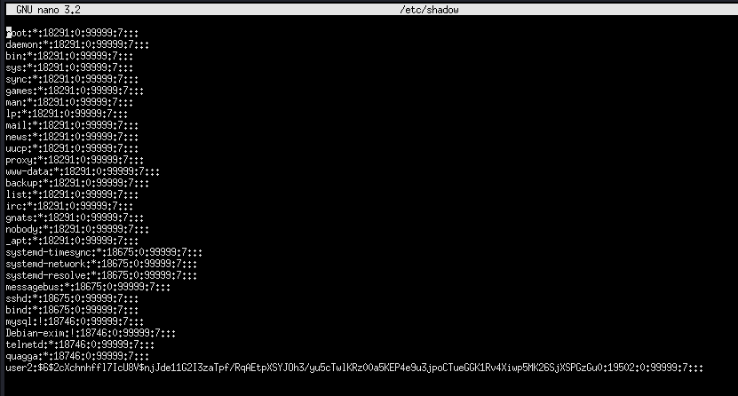

Comprobamos que la contraseña ha sido cambiada de nuevo con `cat /etc/shadow`

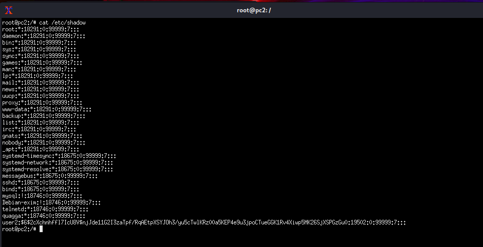

Ahora procederemos de PC3 a realizar un acceso por telnet con las credenciales nuevas de user2.

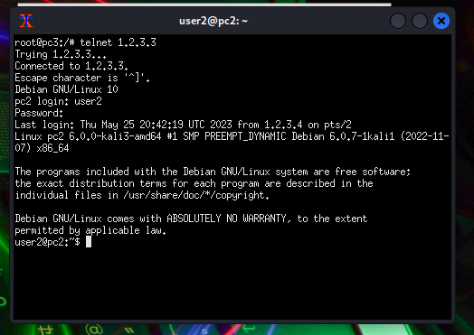

[Volver al índice.](#indice)

---

<br><br><br><br><br><br><br><br>

## Respuesta al apartado 4.

Para obtener la clave de SSH de PC2, se procede a introducir el siguiente comando:

~~~

cat /etc/ssh/ssh_host_rsa_key.pub

~~~

Obtenemos la siguiente respuesta por parte de PC2:

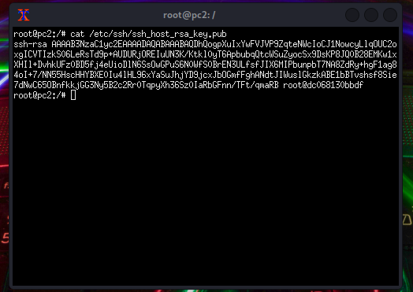

Como podemos ver, la respuesta de la consola es la siguiente:

~~~

root@pc2:/# cat /etc/ssh/ssh_host_rsa_key.pub
ssh-rsa AAAAB3NzaC1yc2EAAAADAQABAAABAQDhQogpXuIxYwFVJVP9ZqteNWcIoCJ1NowcyLlqOUC2oxgICVTIzkS06LeRsTd9p+AUDURjOREIuUN3K/Ktkl0yT6ApbubqQtcWSuZyocSx9DsKP8JQ0B28EMKw1xXHIl+DvhkUFz0BD5fj4eUioDlN6SsOwGPuS6N0WfS0BrEN3ULfsfJIX6MIPbunpbT7NA8ZdRy+hgF1ag84oI+7/NN55HscHHYBXE0Iu4lHL96xYaSuJhjYD9jcxJbOGmfFghANdtJIWuslGkzkABE1bBTvshsf8Sie7dNwC65OBnfkkjGG3Ny5B2c2Rr0TqpyXh36Sz0IaRbGFnn/TFt/qmaRB root@dc068130bbdf

~~~

El encabezado `ssh-rsa` indica que se utiliza el algoritmo de cifrado RSA. La cadena larga que sigue es la clave pública RSA en sí, codificada en formato Base64. El fragmento final `root@dc068130bbdf` es un comentario opcional que indica el origen o el identificador de la clave. En este caso fue el usuario `root` desde la máquina `dc068130bbdf`.

[Volver al índice.](#indice)

---

## Respuesta al apartado 5.

Un ataque de Directory Traversal (o Directory Transversal) consiste en explotar una vulnerabilidad en una aplicación web para acceder y navegar por directorios fuera del directorio permitido. En lugar de acceder a recursos dentro de los límites del directorio, un atacante busca aprovechar la falta de validación o sanitización adecuada de las entradas del usuario para "atravesar" la estructura de directorios y acceder a archivos o información confidencial que no debería ser accesible.

También es común referirse a este tipo de ataque como Path Traversal (o Traversal Attack). Tanto Directory Traversal como Path Traversal son términos utilizados para describir la misma clase de ataque en el contexto de la seguridad de aplicaciones web. El cual pude estudiar y practicar en la asignatura de este Master **M1.872 - Seguridad y pentesting de bases de datos**.

En un ataque de Path Traversal, un atacante intenta acceder a recursos o archivos fuera del directorio permitido, utilizando secuencias de caracteres especiales o manipulando las rutas de archivo en una solicitud HTTP. El objetivo es superar las restricciones de acceso y navegar a través de la estructura de directorios para acceder a información confidencial o ejecutar código arbitrario en el servidor.

[Volver al índice.](#indice)

---
<br><br><br><br><br><br><br><br><br><br><br><br><br><br><br><br><br><br><br><br><br><br><br><br>

## Respuesta al apartado 6.

Aunque indique en el presente apartado 2 técnicas comunes, considero apropiado indicar 3, 2 para puertos del tipo TCP y uno para el tipo UDP. Es común en este tipo de apartados realizar solamente escaneos de puertos TCP, dejando a un lado los UDP. En este caso, explicaré *TCP SYN Scan*, *TCP Connect Scan* y UDP Scan.

- **TCP SYN Scan (sS).**.

  - Consiste en enviar paquetes TCP SYN al puerto de destino y analiza las respuestas. Si se recibe un paquete de respuesta SYN/ACK, se considera que el puerto está abierto, mientras que si se recibe un paquete de respuesta RST, se considera que el puerto está cerrado. El escaneo SYN es rápido y sigiloso, ya que no se completa la conexión TCP.

- **TCP Connect Scan (sT).**

  - En esta técnica, se intenta establecer una conexión TCP completa con los puertos de destino. Nmap intenta establecer una conexión y espera una respuesta positiva o negativa. Si la conexión se establece correctamente, se considera que el puerto está abierto, y si no se puede establecer la conexión, se considera que el puerto está cerrado. El escaneo Connect es más lento y puede ser más detectable, ya que se completa la conexión TCP.

- **UDP Scan (sU).**

  - Se enfoca en escanear puertos UDP. A diferencia del escaneo TCP, que envía paquetes SYN, el escaneo UDP envía paquetes UDP y analiza las respuestas. Los puertos UDP pueden ser más difíciles de escanear, ya que no hay un mecanismo estándar para confirmar si un puerto UDP está abierto o cerrado. El escaneo UDP puede ser más lento debido a las limitaciones y falta de respuesta en algunos casos.

Ahora procederemos a realizar cada una de las técnicas previamente indicadas. Para ello vamos a hacer ifconfig tanto en la terminal de kali y en el firewall para comprobar las direcciones ip de cada uno.

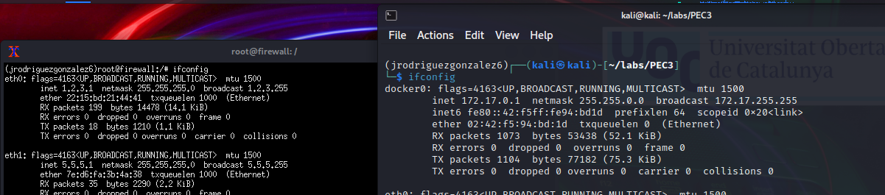

Como podemos ver, la dirección IP de la VM de kali es 172.17.0.1 y la del firewall es 172.17.0.2.

Desde la terminal de Kali procederemos a ejecutar los siguientes comandos para cada uno de los distintas escaneos.

Para TCP SYN Scan:

~~~
sudo nmap -sS 172.17.0.2
~~~

Para TCP Connect Scan:

~~~
sudo nmap -sT 172.17.0.2
~~~

Para UDP Scan:

~~~
sudo nmap -sU 172.17.0.2
~~~

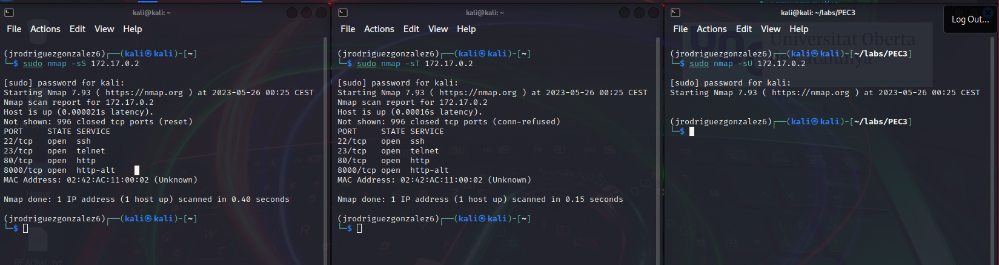

Por duración de mas de 2 minutos del escaneo mediante UDP, he decidido matar el proceso.
Por otro lado, relativo a los puertos TCP, el escaneo reveló cuatro puertos abiertos en el host:

- El puerto 22/tcp está abierto y se identifica como SSH, que es el protocolo utilizado para conexiones seguras remotas.

- El puerto 23/tcp está abierto y se identifica como Telnet, que es un protocolo de comunicación no seguro.

- El puerto 80/tcp está abierto y se identifica como HTTP, que es el protocolo utilizado para el tráfico web estándar.

- El puerto 8000/tcp está abierto y se identifica como http-alt, que es un puerto alternativo utilizado para aplicaciones web, un ejemplo del mismo puede ser para usarse para aplicaciones del tipo SpringBoot en Backend.

- Se proporciona la dirección MAC correspondiente al host como 02:42:AC:11:00:02.

- Relativo a Telnet, se recomienda tenerlo cerrado siempre, ya que la información viaja en claro.

[Volver al índice.](#indice)

---

<br><br><br><br><br><br>

## Respuesta al apartado 7.

Para entrar en el modo privileged procedo a tratar de acceder con el comando `sudo kathara lstart -p`, al ejecutar el comando, me da error, pero leyendo la ayuda me percato que el argumento correcto es `--privileged` por lo que procedo a ejecutar `sudo kathara lstart --privileged`

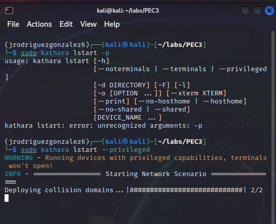

Por ultimo, procedo a realizar un ssh con user3, que es el user de la maquina que tiene según el esquema, usando el puerto ssh, la pass viene en la generación de la máquina en el laboratorio, siendo `Pass1234!`, dando un resultado es exitoso.

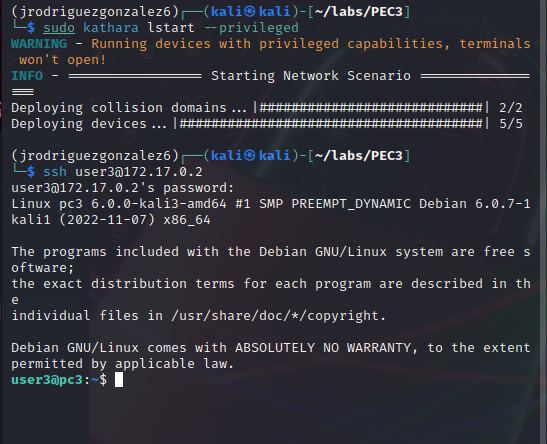

[Volver al índice.](#indice)

---

<br><br><br><br><br><br><br><br><br><br><br><br><br><br><br><br><br><br><br><br><br><br>

## Respuesta al apartado 8.

Para filtrar las direcciones IP que se conectan más de una vez por día al servidor de Telnet honeypot, podemos implementar un proceso de filtrado basado en registros de actividad y programación, para ello.

- Configuración de registro de actividad:

  - Asegurarnos de que el servidor de Telnet honeypot esta configurado para registrar todas las conexiones entrantes, incluyendo la dirección IP del cliente, la fecha y la hora de la conexión.

- Procesamiento de registros:

  - Se procedería a crear un script o programa que analice los registros de actividad generados por el servidor de Telnet honeypot. Este script debe extraer la dirección IP del cliente y la fecha de cada conexión.

- Almacenamiento de registros diarios:

  - Cada día, se guardarían los registros procesados en un archivo o base de datos separados para ese día en particular.

- Filtrado de direcciones IP:

  - Al analizar los registros diarios, identificaríamos las direcciones IP que se conectan más de una vez en un período de 24 horas. Podríamos hacer esto manteniendo un seguimiento de la cantidad de conexiones únicas por dirección IP en cada día.

- Lista de direcciones IP filtradas:

  - A continuación, se crearía una lista de direcciones IP que se hayan conectado más de una vez en un día. Esta lista se debería actualizar diariamente con las nuevas direcciones IP que cumplan con el criterio de filtrado.

- Acciones de filtrado:

  - Se podría implementar diferentes acciones de filtrado según tus necesidades. Algunas opciones podrían incluir bloquear las direcciones IP en el cortafuegos, redirigir las conexiones a un servidor falso o registrar las actividades de las direcciones IP filtradas para su posterior análisis.

[Volver al índice.](#indice)

---

<br><br><br><br><br><br><br><br><br>

## Respuesta al apartado 9.

Para realizar esta acción procederemos a encender WireShark. La interfaz a capturar debe de ser la interfaz Docker de la VM de Kali.

Como se muestra en la siguiente imagen, Ejecutamos una conexión por telnet y procedemos a nuestro login. El usuario y la contraseña han sido cogidas del archivo de configuración del pc2. Procederemos a realizar el login.

Ahora, se procede del análisis de paquetes capturaros. En este caso hemos visto como carga el usuario. carácter por carácter, ya que ha sido escrito a mano, pero la contraseña se ha procedido a pegar del portapapeles directamente, viéndose como resultado que se ve la contraseña entera en claro.


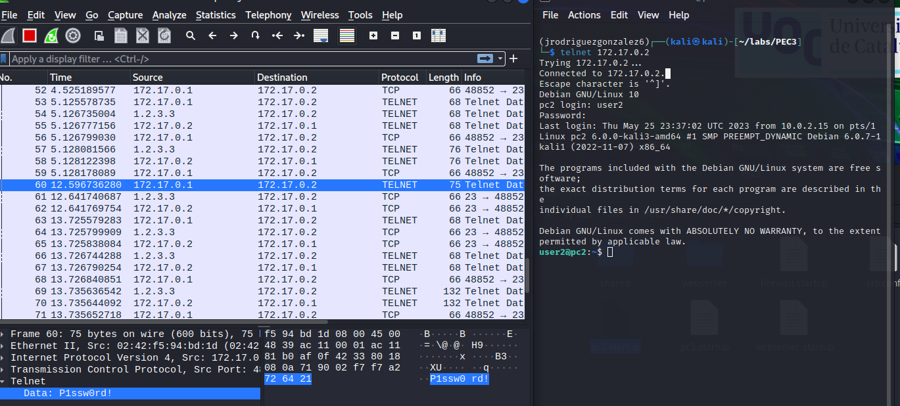

[Volver al índice.](#indice)

---

<br><br><br><br><br><br><br><br><br><br><br><br><br><br><br><br><br>

## Respuesta al apartado 10.

Para proceder a hacer un análisis de la captura, procedo a ordenar por protocolo los paquetes, Una vez ordenados, he buscado palabras claves como puede ser `plain`, que hace referencia a texto plano. Además, el tamaño del paquete es considerablemente grande, por lo que procedo a analizarlo.

Al entrar en el paquete, parece que encontramos un archivo de correo electrónico, el cual dice lo siguiente.

~~~

Dear Manager,\n
 [truncated]I am writing to inform you that we have successfully transitioned from FTP to SSH for our organization's file transfer needs. This move greatly enhances our network security and safeguards our sensitive information from potent
 I would also like to let you know that I have used the same credentials that were used for the FTP server for the SSH connection. The username is user3 and the password is Pass1234!.\n
Please be assured that I have taken all necessary measures to ensure the confidentiality and integrity of our data during this transition. If you have any questions or concerns, please do not hesitate to contact me.\n
Thank you for your attention to this matter.\n

~~~

En el se puede encontrar los siguientes datos:

**user3**

**Pass1234!**


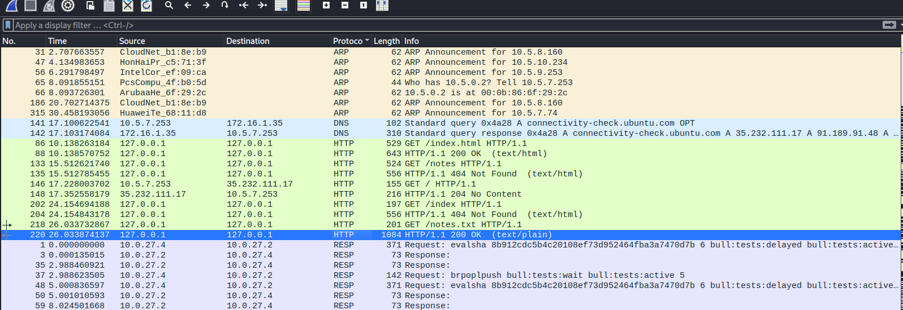


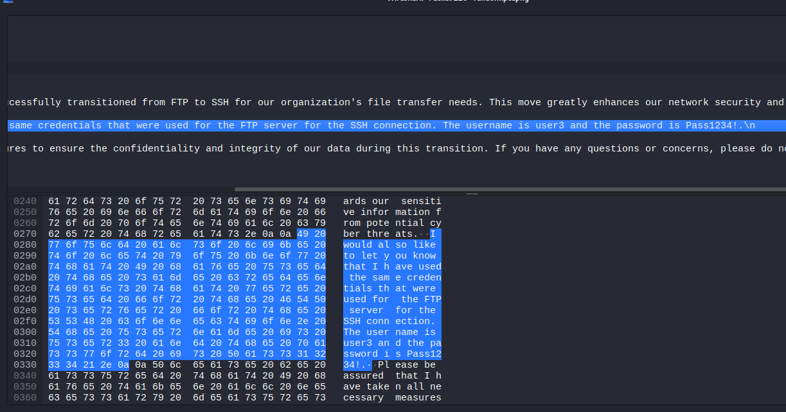

[Volver al índice.](#indice)

---

